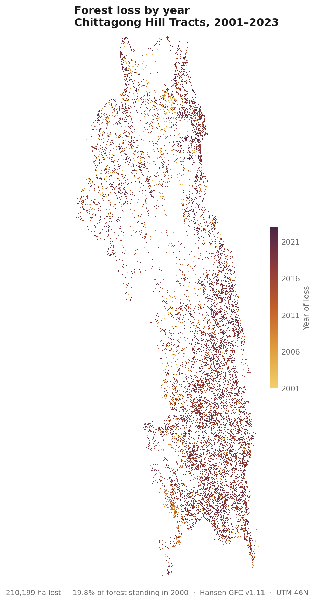
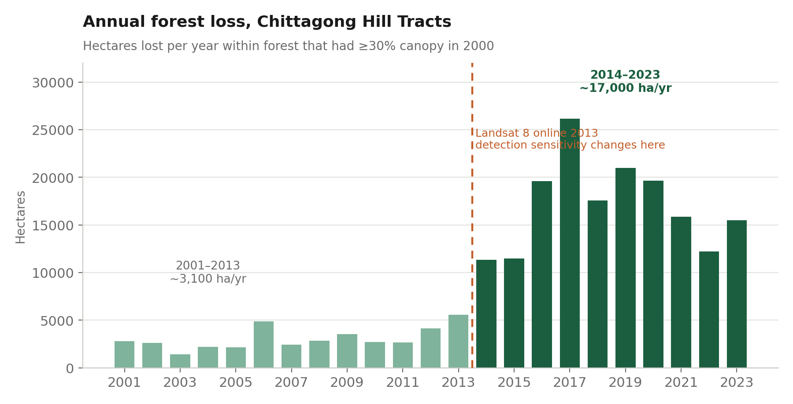
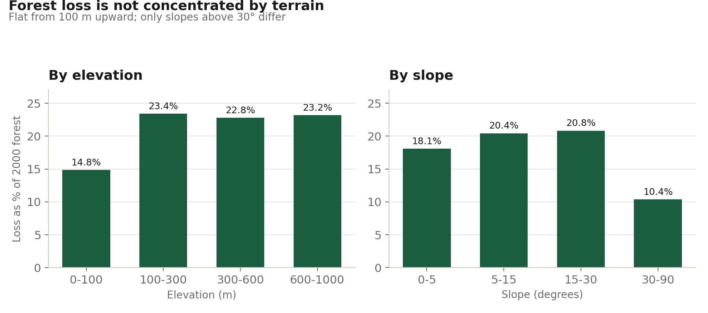
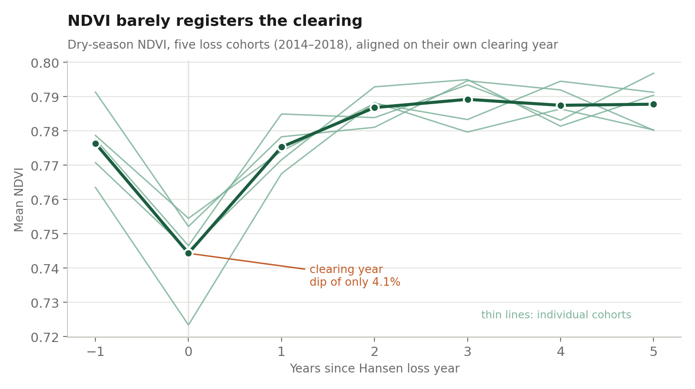
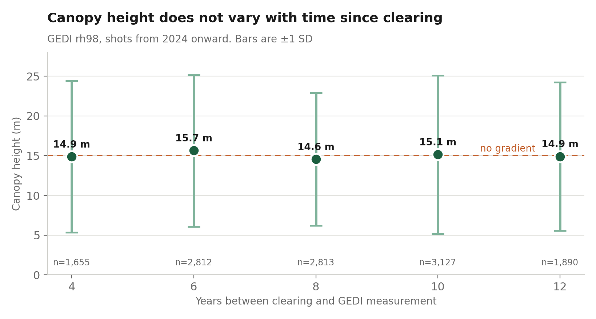

# Forest Cover Change in the Chittagong Hill Tracts, 2001–2023

**210,199 ha of forest lost — 19.8% of the forest standing in 2000 — with annual loss running 5.5× higher after 2014. Three independent satellite methods then failed to determine whether that loss is permanent conversion or rotational clearing, and the reason why is the most useful finding in this project.**



---

## The question

The Chittagong Hill Tracts hold most of Bangladesh's remaining hill forest. Global datasets report heavy "tree cover loss" there, and that number gets quoted in reports and proposals.

But Hansen tree cover loss is not deforestation. It also captures plantation harvest, storm damage, and — critically in this region — **jhum**, the shifting cultivation cycle in which land is cleared, farmed for a season or two, then left to regrow. Rotational clearing and permanent conversion mean completely different things for policy, and they produce the same pixel.

So: how much forest is being lost, and is it coming back?

## What I found

**1. Loss is real, large, and concentrated.**

| | |
|---|---|
| Forest in 2000 (≥30% canopy) | 1,064,201 ha |
| Total loss 2001–2023 | 210,199 ha |
| Share of 2000 baseline | 19.8% |
| Bandarban | 105,521 ha — 50% of all loss |
| Rangamati | 72,104 ha — 34% |
| Khagrachhari | 32,574 ha — 15% |

**2. Annual loss rose sharply from 2014 — but part of that step is a sensor artefact.**



Loss averaged ~3,100 ha/yr from 2001–2013 and ~17,000 ha/yr from 2014–2023, peaking at 26,157 ha in 2017. Landsat 8 came online in 2013 and Hansen's detection sensitivity improved with it, so the break coincides exactly with a change in the instrument. Plantation expansion in the region is well documented and some of this increase is certainly real — but the two cannot be separated with this dataset alone, and any headline built on the 5.5× figure has to say so.

**3. Terrain does not explain where loss happens.**



Loss as a share of baseline forest is flat at 22–23% across every elevation band above 100 m, and flat at 18–21% across slopes up to 30°. Only the steepest ground (>30°) differs, at 10.4% — simply harder to clear. There is no accessibility gradient to exploit. This was a null result; it is reported rather than dropped.

**4. NDVI cannot see the clearing.**



Aligning five loss cohorts (2014–2018) on their own clearing year, dry-season NDVI dips by just **4.1%** — from 0.776 to 0.744 — and returns to baseline within one year. A genuine clear-cut should drop NDVI from ~0.78 to 0.3–0.5. It doesn't here.

A per-pixel recovery test makes the same point. The share of 2018-cleared land classed as "recovered" barely moves with the threshold:

| NDVI must reach this share of pre-clearing | "Recovered" |
|---|---|
| 80% | 97.4% |
| 85% | 95.4% |
| 90% | 91.3% |
| 95% | 81.3% |

When 81% of cleared land passes a 95% recovery bar, the metric is not measuring recovery.

**5. Lidar canopy height shows no regrowth gradient either.**



GEDI `rh98` over land cleared 2 to 12 years before measurement is flat at 14.6–15.7 m. Two-year-old regrowth is not 15 m tall. Standard deviations of ~9 m — over half the mean — point to the cause: GEDI's 25 m footprint plus ~10 m geolocation error means most shots straddle cleared ground and the trees around it, and `rh98` reports the tallest returns in the footprint. It is measuring the neighbours.

## The conclusion

Three methods at three different scales converge on the same wall:

- Hansen **detects** loss at 30 m
- NDVI barely **registers** it — a 4% dip
- GEDI shows **no signal at all**

The clearing in the Hill Tracts happens in patches small and scattered enough that standard global datasets can flag *that* something changed but cannot characterise *what*. The hero map above shows it directly: speckle, not blocks.

For anyone using Hansen figures for this region, that matters. The loss total is defensible. Any claim about *what kind* of loss it is — from these datasets — is not.

## Data

| Purpose | Source | Resolution |
|---|---|---|
| Forest cover and loss | [Hansen Global Forest Change v1.11](https://developers.google.com/earth-engine/datasets/catalog/UMD_hansen_global_forest_change_2023_v1_11) | 30 m |
| Surface reflectance / NDVI | Landsat 8 & 9 Collection 2 Level 2 | 30 m |
| Canopy height | [GEDI L2A](https://developers.google.com/earth-engine/datasets/catalog/LARSE_GEDI_GEDI02_A_002_MONTHLY) monthly, `rh98` | 25 m |
| Terrain | SRTM 1 Arc-Second | 30 m |
| Boundaries | FAO GAUL 2015 level 2 | — |

All open data. No commercial imagery.

## Method

1. **Baseline.** Forest = ≥30% canopy cover in 2000, on land (Hansen `datamask` = 1). The threshold is a judgement call and changes the headline number; it is stated everywhere it matters.
2. **Loss.** Masked to baseline forest — Hansen reports loss on pixels that were never forest, and counting those inflates the total. Annual area computed per district from the `lossyear` band.
3. **Terrain.** Loss reported as a percentage of baseline forest *within each stratum*, not as raw hectares. Raw hectares mostly tells you which band had more forest to begin with.
4. **NDVI trajectory.** Dry-season (Nov–Mar) cloud-masked Landsat composites, five loss cohorts aligned on their own clearing year, each cohort's pre-clearing years serving as its own control.
5. **Canopy height.** GEDI shots from 2024 onward only, so every cohort is measured after its own clearing. An earlier version mixed 2019–2025 shots and contaminated recent cohorts with pre-clearing measurements; that bug is documented below.

## Limitations

- **The 2014 step change is confounded with the Landsat 8 transition.** Stated, not resolved.
- **Hansen `gain` is a single 2000–2012 aggregate**, measured differently from loss. Net change is not computed from loss minus gain here, and shouldn't be elsewhere.
- **NDVI recovery is not forest recovery.** Rubber, teak, banana and dense scrub all reach roughly forest NDVI within a few years. Neither is canopy height conclusive — a mature teak stand is tall.
- **GEDI drops shots on steep terrain**, a real sampling bias in this landscape.
- **A control-group mask returned zero pixels** in two scripts under conditions I could not reproduce or explain. The cohort comparisons stand on their own, but there is no never-cleared benchmark row in the GEDI table. Recorded as an open issue rather than papered over.
- **Separating plantation from natural regrowth** would need radar texture (Sentinel-1), higher-resolution imagery, or field data. Out of scope here.

## Reproduce

```
scripts/01_cht_forest_change.js   Loss totals, district and terrain breakdowns
scripts/02_cht_recovery.js        NDVI trajectory and per-pixel recovery
scripts/03_cht_gedi.js            GEDI canopy height by cohort
figures/mkfigs.py                 All figures from the exported CSVs
data/                             Exported CSVs and GeoTIFFs
```

The `.js` files run in the [Earth Engine Code Editor](https://code.earthengine.google.com). Each exports CSVs to Drive; `mkfigs.py` turns those into the figures above (`pip install matplotlib pandas rasterio`).

**Note on Earth Engine licensing:** GEE's free tier covers research, education and non-commercial use. This project falls under that. Commercial use requires either a commercial Earth Engine licence or reimplementation against the open Landsat and Sentinel archives in Python — which is straightforward for everything here.

## Author

**Muhammad Sajeedul Haque** — B.Sc. (Hons.) Forestry, Institute of Forestry and Environmental Sciences, University of Chittagong.

Geospatial analysis with a forestry background. Available for remote sensing and GIS work.
